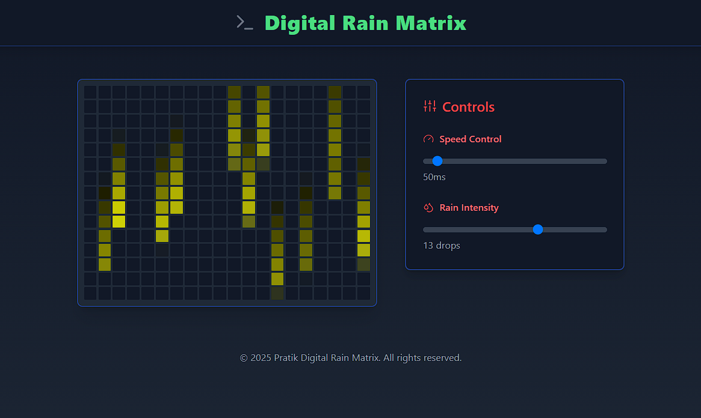

# Digital Rain Animation Project

## Overview
This project is a dynamic digital rain animation inspired by the Matrix. It displays falling rain-like patterns within a grid, where each raindrop has random lengths, speeds, and colors. The application allows users to customize the grid size, animation speed, and interact with the animation in real-time.

---

## Features
- **Dynamic Animation**: Random raindrops with varying lengths and speeds fall continuously on a grid.
- **Customizable Grid**: Adjust the number of rows and columns.
- **Adjustable Speed**: Modify the animation speed via settings.
- **Interactivity**:
  - Pause and resume the animation.
  - Open/close a settings panel to tweak configurations.
- **Gradient Colors**: Raindrops dynamically cycle through color gradients for a vibrant effect.
- **Responsive UI**: Fully responsive grid with clean design and intuitive controls.

---

## Installation

1. Clone the repository:
   ```bash
   git clone https://github.com/Pratikkale26/digital-rain.git
   cd digital-rain
   ```

2. Install dependencies:
   ```bash
   npm install
   ```

3. Start the development server:
   ```bash
   npm start
   ```

4. Open your browser and navigate to:
   ```
   http://localhost:5173
   ```

---

## File Structure
```plaintext
/src
├── components
│   └── RainGrid.tsx    # Main component for the animation
├── App.tsx             # Root component
└── index.tsx           # Entry point
```

---

## Usage
### Controls
1. **Pause/Resume Animation**: Click the "Pause" or "Resume" button.
2. **Settings**:
   - **Rows/Columns**: Use the input fields in the settings panel to adjust the grid size.
   - **Speed**: Adjust the speed of the animation (in milliseconds).

---

## Configuration
### State Variables
- **gridSize**: Defines the grid dimensions (rows and columns).
- **drops**: Array storing properties of all active raindrops.
- **isPaused**: Boolean to toggle animation state.
- **speed**: Controls the interval speed of the animation.

### Customization
- Modify the drop behavior (e.g., length, speed) in the `createNewDrop()` function.
- Change the color gradient in the `getCellColor()` function.

---

## How It Works
### Workflow
1. The grid is dynamically rendered using CSS `grid`.
2. Raindrops are initialized and updated over time using `setInterval`.
3. Colors are calculated based on the proximity of grid cells to falling drops.
4. Users can interact with settings and animations to create unique patterns.

### Key Functions
- **createNewDrop()**: Generates a new drop with random properties.
- **getCellColor()**: Determines the color and opacity of grid cells affected by drops.
- **Animation Loop**: Updates drop positions and triggers new drops when old ones exit the grid.

---

## Technologies Used
- **React**: Frontend framework for building the UI.
- **TypeScript**: Ensures type safety and code reliability.
- **CSS**: For grid layout and styling.

---

## Preview


---

## Future Improvements
- Add more color gradient options.
- Export rain animations as GIFs or videos.

---

## Contributing
Contributions are welcome! Feel free to open an issue or submit a pull request for enhancements or bug fixes.

1. Fork the repository.
2. Create a new branch:
   ```bash
   git checkout -b feature-name
   ```
3. Commit your changes:
   ```bash
   git commit -m "Add your message here"
   ```
4. Push to the branch:
   ```bash
   git push origin feature-name
   ```
5. Open a pull request.


---

## Contact
For questions or feedback, reach out to:
- **Pratik kale**: [Portfolio](https://kalehub.com)
- **GitHub**: [@Pratikkale26](https://github.com/Pratikkale26)
- **X**: [@Pratikkale26](https://x.com/pratikkale26)
- **Linkedin** [@Pratikkale26](https://www.linkedin.com/in/pratikkale26/)
